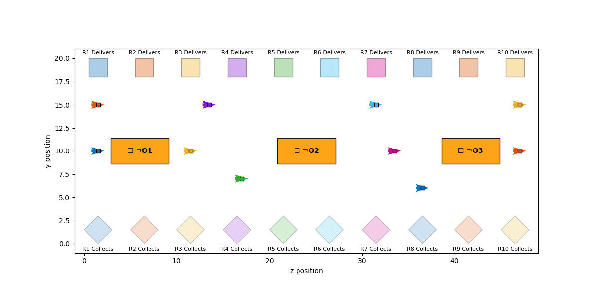

## Multi-agent STL planning with block-coordinate optimization & penalty methods
Imagine a robot fleet assigned a multi-robot signal-temporal-logic (STL) task consisting of collect until deliver tasks while avoiding workspace obstacles, meeting peers within deadlines, and following collision-free trajectories. How would we synthesize multi-robot trajectories to meet such STL specifications respecting robots' dynamics? To address this challenge, we will present an optimization framework based on Block Coordinate Gradient Descent embedded within a penalty method.

  
   
  
  
  

# Multi-Agent STL Planning via BCGD
This repository implements an accelerated **Block Coordinate Gradient Descent (BCGD)** solver for Signal Temporal Logic (STL) specifications.
$f(x) = x$
